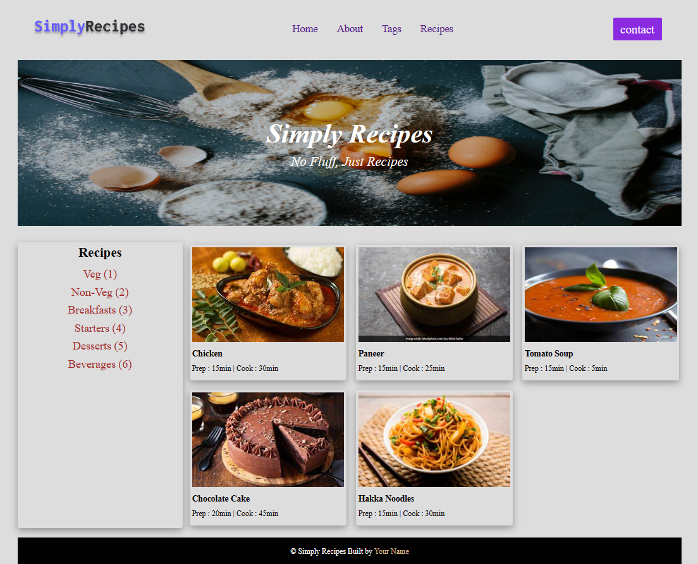

# **DOM Assignment 05**

## **Initial Output**



## Tech Stack


---

## **Task 1**

To append a new button element in the navigation menu named **"Pro Subscription" after the **contact**.

### **Project Solution**

```
const element1 = document.querySelectorAll(".nav-center div");
const proSubButton = document.createElement("a");
proSubButton.innerText = "Pro Subscription";
proSubButton.className = "btn";
proSubButton.href = "#";
element1[2].appendChild(proSubButton);
```

---

## **Task 2**

To append a new anchor element/recipe item in the sidebar of Recipes named **"Chinese (7)" after the **Beverages (6)**.

### **Project Solution**

```
const element2 = document.querySelector(".tags-container div");
const myChinese = document.createElement("a");
myChinese.innerText = "Chinese (7)";
myChinese.href = "#";
element2.appendChild(myChinese);
```

---

## **Task 3**

To append a new div element in the main section containing text of **"add 6th card here"**.

### **Project Solution**

```
const element3 = document.querySelector(".recipe-gallery");
const mynewDIV = document.createElement("div");
mynewDIV.innerText = "add 6th card here";
mynewDIV.style.fontWeight = "bold";
mynewDIV.className = "card";
element3.appendChild(mynewDIV);
```

---

### **After Update**


---